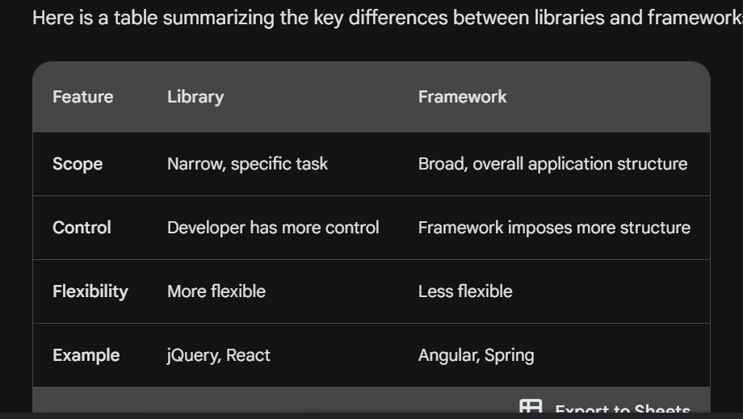

1. Difference between a Library and Framework?
- In essence, libraries are like tools that you can use to achieve specific tasks, while frameworks are like blueprints that provide the foundation for building a complete application.

2. What is CDN? Why do we use it?
- A CDN, or Content Delivery Network, is a geographically distributed network of servers that work together to deliver content to users.
- When a user requests a website or a web application, the request is routed to the CDN server that is closest to the user.
- This means that users can load websites and web applications faster, as they don't have to wait for the content to travel from a server that is far away

- Example of how a CDN works:
Imagine you have a website that is hosted on a server in California. A user in New York requests a page from your website. Instead of the user's request going to the California server, it is routed to a CDN server in New York. The CDN server then fetches the requested page from the California server and sends it to the user. This all happens in a matter of milliseconds, so the user never sees any difference in the speed at which the page loads.

- Key benefits of using a CDN:
Improved website performance: Faster loading times and reduced latency for users
Reduced bandwidth costs: Cost savings by caching content at multiple locations
Increased website availability: Improved uptime and reduced downtime
Reduced stress on origin servers: Less load on the main server, allowing it to handle more traffic

3. Why is React known as React?

● What is crossorigin in script tag?
● What is diference between React and ReactDOM
● What is difference between react.development.js and react.production.js files via CDN?
● What is async and defer?